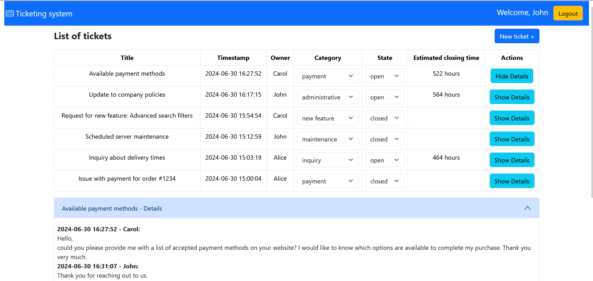
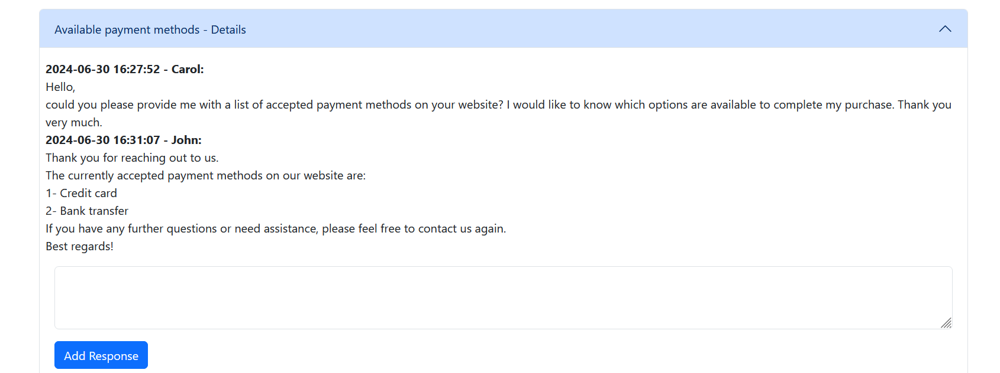
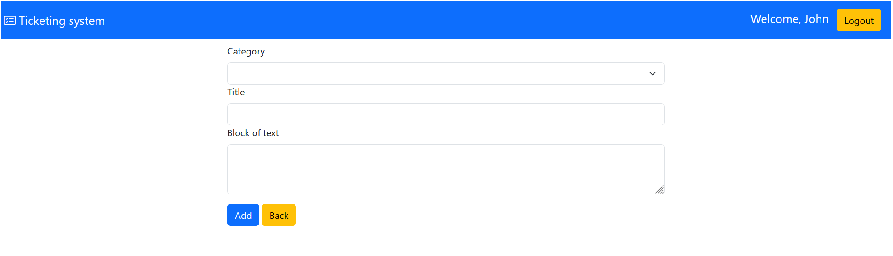
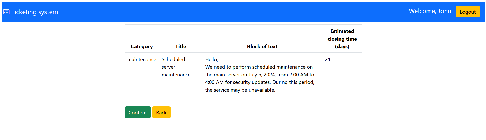

# Ticketing system

## Application Description

This web application implements a comprehensive ticketing system. The system allows users to submit and manage tickets, which are composed of a state (open/closed), a category, an owner, a title, a timestamp, and one or more blocks of text. To improve readability, the text blocks support bold and italics formatting, as well as newlines. 

The application distinguishes between three levels of access and capabilities:

* **Unauthenticated Visitors:** * Can view a read-only list of all tickets, sorted chronologically from the newest to the oldest. 
    * Can only see basic details: title, timestamp, owner, category, and state.
* **Authenticated Users:**
    * Can create a new ticket by providing a category, a title, and an initial text block.
    * Must review their submission through a read-only confirmation page before sending data to the server, with the option to go back and edit.
    * Can expand any ticket from the list to read all its associated text blocks (along with their author and timestamp) in chronological order.
    * Can add additional blocks of text to any ticket, as long as the ticket is not closed.
    * Can mark their own tickets as "closed" at any time.
    * Can view an estimated resolution time (with day-level precision) displayed on the confirmation page during a new ticket submission.
* **Administrators:**
    * Inherit all capabilities of standard authenticated users.
    * Can change the category of any ticket.
    * Can mark any ticket as "closed" or reopen any closed ticket.
    * Can view the estimated resolution time (with hour-level precision) directly in the main ticket list.

The platform utilizes a dual-server architecture: while the main API server handles standard operations, a secondary server is dedicated to computing the estimated ticket completion time. This estimation is calculated dynamically as a function of the length of the ticket title and category, plus a randomly generated variable.

## Setup and Configuration

Before running the application, you must configure the environment variables for both backend servers. Create a `.env` file in the root of each server directory as specified below:

### 1. Main Server Configuration

Create a `.env` file inside the `server/` directory and populate it with your secrets:
```env
JWT_SECRET=your_secret_key_here
SESSION_SECRET=your_session_secret_here
```

### 2. Server2 Configuration

Create a `.env` file inside the `server2/` directory and add the JWT secret (it must match the one used in the main server):
```env
JWT_SECRET=your_secret_key_here
```

## React Client Application Routes

- Route `/`:  Home page, shows the list of all tickets. Logged in users can also see the text blocks associated with each ticket and add one. 
- Route `/login`: Login form, allows users to login. After a successful login, the user is redirected to the main route ("/").
- Route `/add`: Add form, allows users to add a ticket into the system. After a successful addition, with a previous confirmation, the user is redirected to the main route ("/").
- Route `*`: Page for nonexisting URLs (_Not Found_ page) that redirects to the home page.

## API Server

#### GET `/api/tickets`
Returns all tickets in the system
  - Response: `200 OK` (success) or `500 Database error: + error` (error)
  - Response body: JSON object with the list of tickets or error
    ```
    [
      {
        "id": "6",
        "state": "open",
        "category": "payment",
        "owner": "Carol",
        "title": "Available payment methods",
        "timestamp": "2024-06-30 16:27:52",
        "items": []
      },
      {
        "id": "5",
        "state": "open",
        "category": "administrative",
        "owner": "John",
        "title": "Update to company policies",
        "timestamp": "2024-06-30 16:17:15",
        "items": []
      }
    ]
    ```

#### GET `/api/tickets/items`
Returns all tickets in the system with their associated text blocks
  - Response: `200 OK` (success), `401 Not authorized` (error) or `500 Database error: + error` (error)
  - Response body: JSON object with the list of tickets (with text blocks) or error 
    ```
    [
      {
        "id": "6",
        "state": "open",
        "category": "payment",
        "owner": "Carol",
        "title": "Available payment methods",
        "timestamp": "2024-06-30 16:27:52",
        "items": [
          {
            "author": "Carol",
            "block": "Hello,\ncould you please provide me with a list of accepted payment methods on your website? I would like to know which options are available to complete my purchase. Thank you very much.",
            "timestamp": "2024-06-30 16:27:52"
          },
          {
            "author": "John",
            "block": "Thank you for reaching out to us.\nThe currently accepted payment methods on our website are:\n1- Credit card\n2- Bank transfer\nIf you have any further questions or need assistance, please feel free to contact us again.\nBest regards!",
            "timestamp": "2024-06-30 16:31:07"
          }
        ]
      },
      {
        "id": "5",
        "state": "open",
        "category": "administrative",
        "owner": "John",
        "title": "Update to company policies",
        "timestamp": "2024-06-30 16:17:15",
        "items": [
          {
            "author": "John",
            "block": "Hello,\nWe need to update the company policies for remote work in compliance with new state regulations. Please review and approve the proposed changes by July 10, 2024.",
            "timestamp": "2024-06-30 16:17:15"
          },
          {
            "author": "George",
            "block": "You will find the new policies in the notices section.",
            "timestamp": "2024-06-30 16:22:25"
          }
        ]
      }
    ]
    ```
  - Access Constraints: Can only be called by a logged in user

#### POST `/api/ticket`
Add a new ticket with its text block in the system
  - Request Body: category, title, block (Content-Type: `application/json`)
    ```
    {category: "payment", title: "Title 1", block: "Try inserting ticket"}
    ``` 
  - Response: `200 OK` (success), `401 Not authorized` (error), `422` (validation error) or `503 Database error during the creation of new ticket: + error` (error)
  - Response body: _None_ or JSON object error 
  - Access Constraints: Can only be called by a logged in user

#### POST `/api/ticket/<id>/item`
Add a new block of text to a ticket
  - Request Parameters: id --> Example: `/api/ticket/2/item`
  - Request Body: block (Content-Type: `application/json`)
    ```
    {block: "Try inserting ticket"}
    ``` 
  - Response: `200 OK` (success), `422` (validation error), `401 Not authorized` (error), `401 Unauthorized operation!` (error)  or `503 Database error during the creation of new item for the ticket: + error` (error)
  - Response body: _None_ or JSON object error 
  - Access Constraints: Can only be called by a logged in user

#### PUT `/api/ticket/<id>/state`
Change the state of a ticket
  - Request Parameters: id --> Example: `/api/ticket/2/state`
  - Request Body: state (Content-Type: `application/json`)
    ```
    {state: "closed"}
    ``` 
  - Response: `200 OK` (success), `422` (validation error), `401 Not authorized` (error), `401 Unauthorized user!` (error)  or `503 Database error while editing ticket + error` (error)
  - Response body: JSON object with the update ticket or error 
    ```
    {
      "id": "6",
      "state": "closed",
      "category": "inquiry",
      "owner": 3,
      "title": "Available payment methods",
      "timestamp": "2024-06-30 16:27:52",
      "items": []
    }
    ```
  - Access Constraints: Can only be called by a logged in user

#### PUT `/api/ticket/<id>/category`
Change the category of a ticket
  - Request Parameters: id --> Example: `/api/ticket/2/category`
  - Request Body: category (Content-Type: `application/json`)
    ```
    {category: "payment"}
    ``` 
  - Response: `200 OK` (success), `422` (validation error), `401 Not authorized` (error), `401 Unauthorized user!` (error)  or `503 Database error while editing ticket + error` (error)
  - Response body: JSON object with the update ticket or error 
    ```
    {
      "id": "6",
      "state": "open",
      "category": "payment",
      "owner": 3,
      "title": "Available payment methods",
      "timestamp": "2024-06-30 16:27:52",
      "items": []
    }
    ```
  - Access Constraints: Can only be called by a logged in user

### Authentication APIs

#### POST `/api/sessions`
Create a new session starting from given credentials.
  - Request body:
    ```
    {
      "username": "u1@p.it",
      "password": "pwd"
    } 
    ```
  - Response: `200 OK` (success), `401 "Incorrect username or password"` (error) or `500 Internal Server Error` (generic error).
  - Response body: JSON object with the user ticket or error
    ```
      {
        "id": 1,
        "email": "u1@p.it",
        "name": "John"
        "level": "admin"
      }
    ```

#### DELETE `/api/sessions/current`
Delete the current session. A cookie with a VALID SESSION ID must be provided.
  - Response: `200 OK` (success) or `500 Internal Server Error` (generic error).
  - Response body: _None_
  - Access Constraints: Can only be called by a logged in user

#### GET `/api/sessions/current`
Verify if the given session is still valid and return the info about the logged-in user. A cookie with a VALID SESSION ID must be provided to get the info of the user authenticated in the current session.
  - Response: `200` (success) or `401 Unauthenticated user!` (error).
  - Response body: 
    ```
      {
        "id": 1,
        "email": "u1@p.it",
        "name": "John"
        "level": "admin"
      }
    ```   

#### GET `/api/auth-token`
Returns an auth token for the logged in user.
  - Response body: JSON object with token or error
  - Codes: `200 OK`, `401 Unauthorized`.


## API Server2

#### POST `/api/ticket-stat`
Return an estimation of the amount of time to close a ticket.
  - Request Headers: authToken 
  - Request Body: ticket, position (Content-Type: `application/json`)
    ```
    { ticket: {id: "1", state:"closed", category:"payment", owner: "Alice", title: "Issue with payment for order #1234", timestamp: "2024-06-30 15:00:04", items:[{ "author": "Alice", "block": "Hello,\nI encountered an issue with the payment for my order #1234. The transaction was declined despite having sufficient funds on my card. Can you check and resolve the situation?", "timestamp": "2024-06-30 15:00:04"}]}, position: "list"}
    ```   
  - Response: `200 OK` (success), `401 Authorization error` (error) or `400 Invalid ticket data` (error) 
  - Response body: JSON object with the estimation or error
    ```
    {"estimation":485}
    ```
  - Access Constraints: Can only be called by a logged in user


## Database Tables

- Table `users`: **id**, email, name, hash, salt, level. 
  - _level_: admin or basic
- Table `ticket`:  **id**, state, category, owner, title, timestamp
  -  _owner_: id taken from the table of users
- Table `item`:  **ticketID**, **authorID**, **timestamp**, block
  -  _ticketID_: id taken from the table of ticket
  -  _authorID_: id taken from the table of users

## Main React Components

- `MyHeader` (in `Layout.js`): component to manage the header of the page, has a button to manage the login and logout within the site.
- `DefaultRoute` (in `Layout.js`): component to manage the page in case of wrong url.
- `LoginForm` (in `LoginComponent.js`): : component to manage the login. This is responsible for the client-side validation of the login credentials (valid email and non-empty password).
- `TicketTable` (in `TicketComponent.js`): component to display all tickets in tabular form, also allows authorized users to make inline changes to the ticket through combo boxes (for example: category and state). It also manages the display of text blocks of each ticket through a button ("Show Details"/"Hide Details").
  - `TicketRow` (in `TicketComponent.js`):component to manage the display of each ticket in the table. 
  - `ItemsBlock` (in `TicketComponent.js`): component to manage the display of all text blocks linked to a single ticket. It also allows if a ticket status is "open" to insert a new text block. 
- `TicketForm` (in `FormComponent.js`): component to manage adding a new ticket to the system. It also shows after the user has filled in all the fields and pressed the button "Add" a summary page to manage the final sending of data to the server that happens through the button"Confirm".

## Screenshot






## Users Credentials

| email | password | name | level |
|-------|----------|------|-------------|
| u1@p.it | pwd | John | admin |
| u2@p.it | pwd | Alice | basic |
| u3@p.it | pwd | George | admin |
| u4@p.it | pwd | Bob | basic |
| u5@p.it | pwd | Carol | basic |

